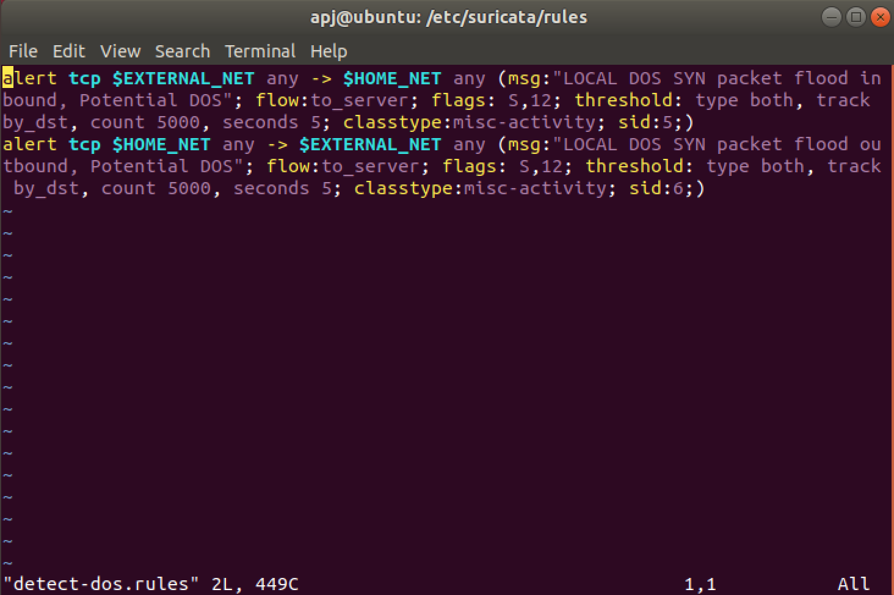
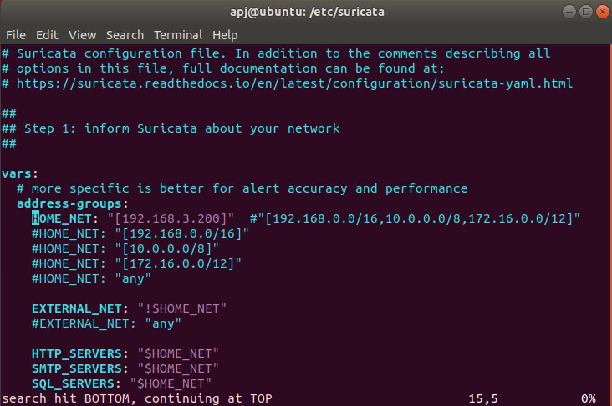
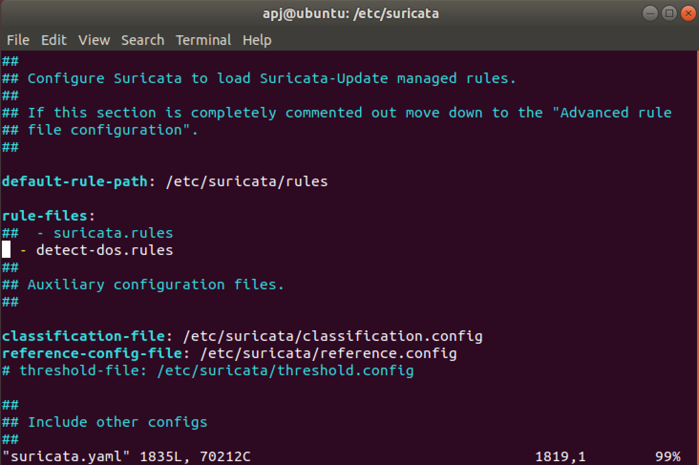
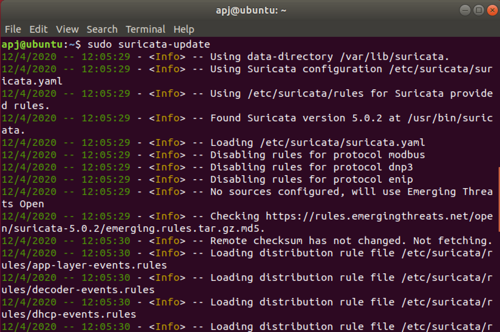
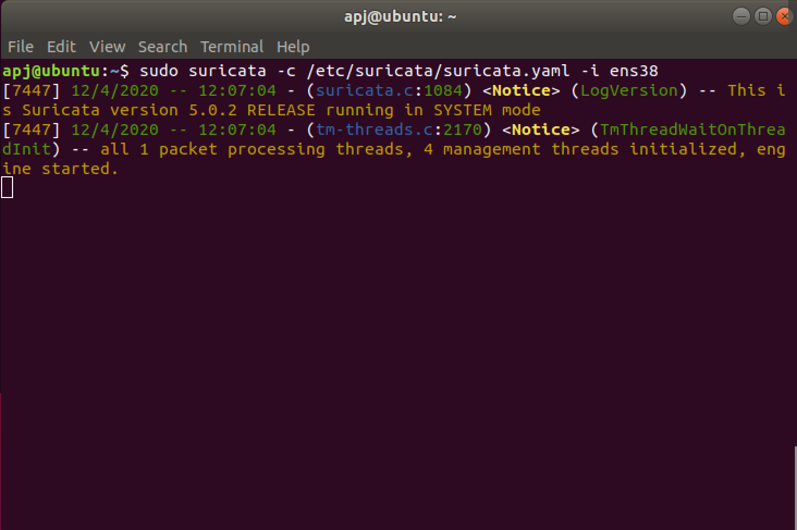
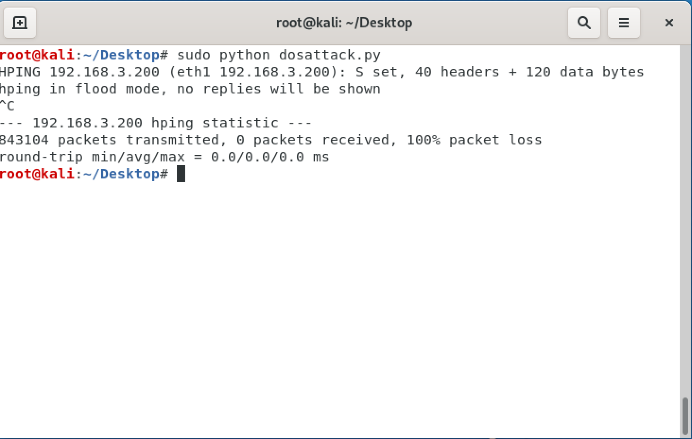
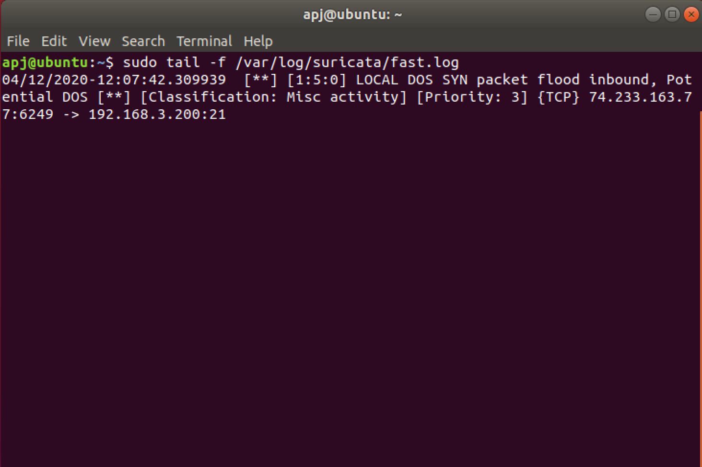

# Suricata detect DOS attack

For this task 2 VMs are used:
1. an Ubuntu VM (192.168.3.200) 
2. Kali Linux VM (192.168.3.153)

## Install Suricata
For installing suricata (and suricata debugger) in the Ubuntu VM the following commands are executed in order:

        sudo add-apt-repository ppa:oisf/suricata-stable
        sudo apt update && sudo apt upgrade -y
        sudo apt install suricata suricata-dbg

## Adding DOS detection rule
For this a file `detect-dos.rules` is created with the following contents:  

        alert tcp $EXTERNAL_NET any -> $HOME_NET any (msg:"LOCAL DOS SYN packet flood inbound, Potential DOS"; flow:to_server; flags: S,12; threshold: type both, track by_dst, count 5000, seconds 5; classtype:misc-activity; sid:5;)
        alert tcp $HOME_NET any -> $EXTERNAL_NET any (msg:"LOCAL DOS SYN packet flood outbound, Potential DOS"; flow:to_server; flags: S,12; threshold: type both, track by_dst, count 5000, seconds 5; classtype:misc-activity; sid:6;)

The file is placed in the directory /etc/suricata/rules. The file includes 2 rules that are used to alert SYN flood attack. 
The common parameters in the rules are the actions:

- `alert` which alerts when the conditions in the rule are met.
- `tcp` the protcol that rule focuses on.
- `$EXTERNAL_NET` & `$HOME_NET` are set of ip addresses specified in the file `/etc/suricata/suricata.yaml`.
- `msg` parameter has the content which shows up during the alert.
- `flags` contains S for SYN packet.
- `threshold` parameter is set to both, which includes:
    - threshold to set a minimum threshold for a rule before it generates alerts.
    - limit to  make sure system does not get flooded with alerts.

    Here the alert will be generated if there are more than 5000 TCP SYN packets incoming within the next 5 seconds

## Configuring Suricata

The contents of the suricata.yaml file is updated as follows:

The value of HOME_NET is updated with the IP address of the Ubuntu VM:
	
        HOME_NET: "[192.168.3.200]"

The newly created rule file which was placed in the appropriate directory is added to the rule-files list: 

        rule-files:
        - detect-dos.rules

NOTE: if the rule-files is pointing to a different directory update rule-files location with /etc/suricata/rules.

## Update Suricata

Once this is done rules are updated within Suricata with the command:

	    suricata-update

## Execute Suricata IDS

Now the IDS is executed with the following command:

        suricata -c /etc/suricata/suricata.yaml -i ens33 

NOTE: The interface on which the IDS should be listening is provided with -i flag. Also no warning or error should come up regarding the rules while running the IDS.

## Conduct DoS attack

Now the DOS attack is conducted from the Kali Vm using the python script `dos_attack.py` which utilizes the `hping3` network utlity to generate and flood TCP SYN packet to the target IP address (the IP address can be updated by changing the file contents).

        python dos_attack.py

## Results 

Now the IDS rules get triggered and suricata alerts that there is a possible DOS attack, this can be seen in the logs with the command:

        sudo tail -f /var/log/suricata/fast.log

Hence suricata acted as an IDS and detected the DoS attack.
